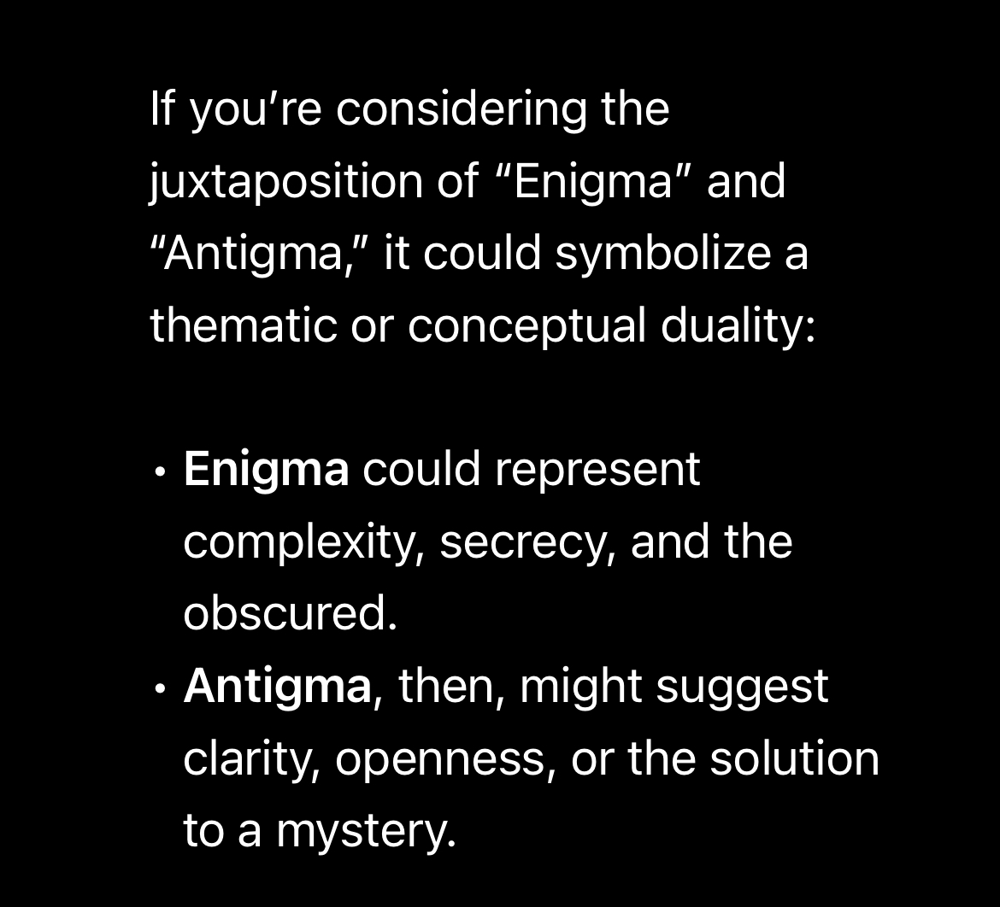

# Antigma Manifesto
In the foreword to "The Sovereign Individual," Peter Thiel famously put AI and crypto at opposite ends of future conflicts. He saw AI as enabling central economic control, while crypto offered a decentralized, individualized world. While acknowledging this dichotomy, we propose a different vision: these technologies are not “two extreme poles of the great conflicts”, but convergent and complementing forces that will reshape our future.

The relationship between AI and crypto traces back to their shared origins. In 1939, Alan Turing joined Britain's codebreaking center at Bletchley Park, where the first computer was born to break the Enigma cipher and this moment intertwined the fates of AI and cryptography, setting the stage for our current technological revolution.

We believe that AI, particularly systems that enhance people's lives, must connect at a personal level. Each individual, like a unique grain of sand or a distinct snowflake, yearns to be understood. This drive will push AI towards decentralization, tailoring itself to each person's needs and values. Simultaneously, crypto will evolve beyond its current fragmented state, playing a crucial role in identity, sustainability, and community formation.

Large Language Machine (Model) is the next stage of the Turing Machine, - a new paradigm of computing. In honor of the anti-Enigma efforts that spawned the first computer, we've named our endeavor "Antigma". Our mission is to build the substrate for a future of self-organizing intelligence, where AI and crypto converge to empower individuals and communities.

Our work will be built on three pillars

- **Privacy through private networks**
- **Trust with trust boundaries**
- **Tribute via compute united**

We'll explore each of these ideas in more detail soon.
